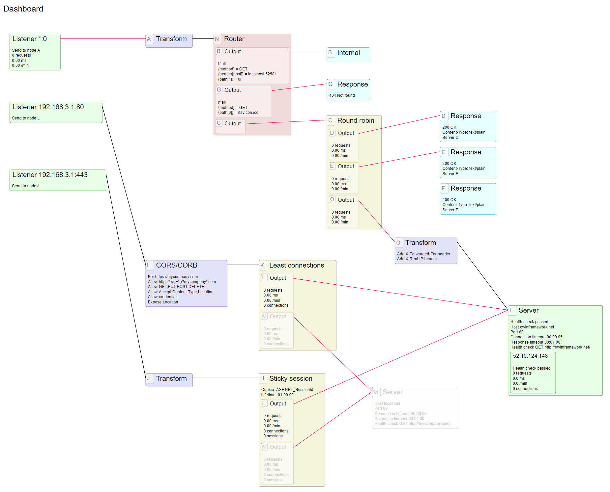

# Gravity

A reverse proxy and load balancer written with C# and running on OWIN

## Status

This has reached MVP now and has received some testing. If you are interested in
using this code please beta test and let me know what you find.

## Features

This is an OWIN based service. The source code as-is will run on IIS but you can
easily customize it to run on Apache, self host (.exe) etc as supported by OWIN.

### Dashboard

The Gravity server contains a dashboard page that is refreshed periodically and
looks like the screenshot below with using the test configuration checked into 
the source code.



You can configure a graph of nodes that define how requests are processed and link
these nodes together in arbirtary ways. Any node can have its 'disabled' property
set to temporarily turn it off this can be useful for example when you want to
remove a server from the load balancer for maintenance or put up a maintenance mssage
when the whole site is down for maintenance.

The nodes draw in a dimmed grey color when they are disabled or offline because health
checks failed. Active nodes are color coded by their function to make the diagram
easier to understand at a glance.

The lines on the drawing can be:

* black - when the traffic is not being measured at this point
* red - when there is no traffic on this link
* thin green - when there is light traffic
* medium green - when there is moderate traffic
* thick green - when there is high traffic

### Listener Node

Defines an IP address and port number to process requests for. Also support wildcard
that matches all IP addresses and/or all ports. If running on IIS these IP addresses
and ports must be configured in the IIS bindings.

Each listener measures the request rate and average request processing time.

### Server Node

Defines a server to send requests to. You can specify an IP address or DNS name, and
when a DNS name is specified it can resolve to multiple IP addresses. The server health
checks all IP addresses and distributes requests across all the healthy ones. This means
that you can bind your web server to multiple IP addresses on different networks and if
one network fails the traffic will all be routed to the one that still works.

Each server node measures the request rate and average request processing time for
each IP address.

If all IP addresses for the server are unhealthy then the server is taken offline.
When the server is offline all upstream nodes are also taken offline so that for
example if you put a round robin node in front of multiple servers then any failing
servers will not be sent requests by the round robin.

### Router Node

Matches requests and directs traffic to different paths through the load balancer.
For example you can route requests to different pools of servers based on the host
header, path, query string etc. You can also route GET requests to a larger pool
of servers than PUT, POST and DELETE requests for example.

This node is also useful for segregating traffic from specific IP address ranges
and handling it differently, for example more detailed logging or specific fixed
responses.

Note that this node matches requests, not responses. You can not route traffic
based on the response because the traffic must have already been routed to a server
in order to have a response.

### Transform Node

Applies URL Rewrite module rules to a request. See the readme file in my UrlRewrite.Net 
repo for a detailed definition of the rule syntax. Rules can be applied to the incomming
request, the outbound response or both. The rules can be embedded directly into the
load balancer configuration or supplied in an separate file.

These rules affect the request header only. This node does not modify the content
of the request or response.

### Response Node

Returns a fixed rersponse. This is useful for serving static content, returning 404,
putting up a maintenance message when your website is down for updates etc.

### CORS Node

Implements the logic required to support CORS requests - for example if you have
web services in sub-domains that need to be called from your main site domain.

### Internal Node

Any requests routed to this node will be passed to the rest of the OWIN pipeline
and handled within the load balancer. You can use this to expose the UI that the
load balancer contains for checking the configuration and monitoring traffic flow
through the load balancer.

### Round Robin Node

These nodes are configured with a list of output nodes and forward requests in a
round robin fashion. Any outputs connected to a downstream that is offline will be
not have requests sent to them so that we are not sending requests to dead servers.

### Sticky Session Node

These nodes look for a session cookie in the request and send requests with a
specific session IO always to the same server. When a new session ID is encountered
the request is send to the server with the least number of active connections and
the session cookie that is set by the server is captured in the response so that
this client will be routed to the same server again on the next request.

### Least Connections Node

These nodes have a list of nodes to send requests to next and always send requests
to the output that has the least number of active connections.

### Log Level Node

These nodes change the level of detail in the log. This allows you to capture more
detail for requests that are pssing through a specific portion of the pipeline.

### Custom Log Node

These nodes capture information about specific request types and write a log file
to disk. You can specify which request methods to capture (POST, GET etc) or capture
all methods, and you can specify the return codes to capture (503, 200, 404 etc) or
capture all response codes. If you want to be more specific about what to capture
please configue a Router Node in front of the Custom Log.

## Compiling and running

1. Install Visual Studio version 2013 or later
2. Download the source code.
3. Run the 'restore.cmd' command script.
4. Open the solution in Visual Studio.
5. Press F5.
6. You should see the dashboard.

## Installing

To run the load balancer from the original source code you need to configure a
website in IIS. If you want to handle HTTPS then you need to install the HTTPS
certificate into IIS as well. To run on another hosting platforn you will need to
make some minor changes to the .Net project.

Copy files from the `Gravity.Server` folder to your production server as follows:
1. `web.config` - no changes are required in this file.
2. `config.json` - you need to put your load balancer configuration in this file.
3. `bin\*.dll` - you only need to copy the `.dll` files from the `bin` folder.

Point IIS to the root folder (where `web.config` is located).

Set the IIS AppPool to .Net 4.5 Integrated mode.

## Configuring

I will write some detailed documentation later. For now please see the classes in
the `Gravity.Server\Configuration` folder where there are documentation comments
describing the configuration options.

### Router Node

A simple Router Node configuration might look like this:

```
{
  "name": "N",
  "routes": [
     {
        "to": "B",
        "logic": "All",
        "groups": [
          {
            "logic": "All",
            "conditions": [
              { "condition": "{method} = GET" },
              { "condition": "{path[1]} = ui" },
              { "condition": "{ipv4} = loopback" }
            ]
          },
          {
            "logic": "Any",
            "conditions": [
              { "condition": "{header[host]} = localhost:52581" },
              { "condition": "{header[host]} = gravity.localhost" }
             ]
          }
        ]
     },
     {
       "to": "G",
       "logic": "All",
       "conditions": [
           { "condition": "{method} = GET" },
           { "condition": "{path[0]} = /favicon.ico" }
       ]
     },
     {
       "to": "C"
     }
  ]
}
```

The Router Node must have a name, the name should be kept short and should not
contain any spaces or special characters. When the node is displayed on a dashboard
you can choose a display label for the node, so this node name is not normally shown
anywhere, it is used to connect nodes together.

The router must have a list of routes. These are the other nodes in the graph where
the router can route requests. Each route must have a 'to' field that is the name of
the node to route traffic to. Everything else is optional.

The router evaluates the routes in the order that they are written and finds the
first one that matches the request and in online. Online means that there is a
downstream path to a node that produces responses. If there is no way to get a 
response from a given route then that route will be skipped and the logic will
move on to the next route in the list. This is useful for displaying maintenance
pages when the system is down for maintainance for example.

#### Groups

Groups are a way of combining expressions. Each group has a 'logic' property that
defines how the expressions are combined. The options for the 'logic' property are:

All - meaning all expressions must be true for the group to have a true value.
Any - meaning at least one of the expressions must be true for the group to have a true value.
None - meaning that all expressions must be false for the group to have a true value.

The expressions inside the group can either be `conditions` or nested `groups` or both. The route
is a special kind of group that also has logic, groups and conditions, but additionally
has a `to` property,

#### Conditions

Each condition is an expression and some flags, for example:

```
{ "condition": "{ipv4} = 192.168.0.0/16", "negate": false, "disabled": false }
```

Conditions can be inverted by setting the negate property to true, and they can
be temporarily removed from the logic by setting their disabled property to true.

The condition property consists of two expressions separated by an `=` sign. The
`=` sign can be prefixed with another symbol whose meaning varies with the type
of value that is being compared as follows:

For string comparisons, the comparison operators are:

`=` meaning that the two expressions evaluate to the same case insensitive string.
`<=` meaning that the left expression matches the beginning of the right hand expression.
`>=` meaning that the left expression matches the end of the right hand expression.
`!=` meaning that the two expressions evaluate to different case insensitive strings.
`~=` meaning that the left expression is contained within the right hand expression.

For number comparisons, the comparison operators are:

`=` meaning that the two expressions evaluate to the same numeric value.
`<=` meaning that the left expression is numerically less or eaqual to the right hand expression.
`>=` meaning that the left expression is numerically greater or eaqual to the right hand expression.
`!=` meaning that the two expressions evaluate to different numeric values.

For IP address comparisons the prefix is ignored.
`=` meaning that the left expression is an IP address contained in the CIDR block of the right hand expression

#### Expressions

The expressions in conditions are taken an literal values unless they are enclosed in curly
braces. The curly braces define what to retrieve from the incoming request as follows:

`{path[0..n]}` - retrieves an element from the path. `{path[1]}` is the first path element, 
`{path[2]}` is the second element etc. `{path[-1]}` is the last path element, `{path[-2]}`
is the second to last etc.

`{path}` - retrieves the entire path including the leading `/` character.

`{header[name]}` - retrieves a header from the request, for example `{header[Accept]}` 
returns the `Accept` header from the request.

`{query[name]}` - retrieves a query string parameter, for example the expression `{query[page]}`
for a request url of `https://mydomain.com/news/current?page=3` would return the value `3`.

`{null}` - retrieves a null value. This can be used to test for the absence of something.
For example the condition `{query[page]} = {null}` is true for any request that does not have
a `page` parameter in the query string.

`{method}` - retrieves the request method. The returned value will be `POST`, `GET`, `PUT`, `DELETE`, `OPTIONS` etc.

`{ipv4}` - retrieves IP v4 address where the request came from.

`{ipv6}` - retrieves IP v6 address where the request came from.

When using `{ipv4}` or `{ipv6}` you can use some special notation for the right side expression. There
are a small number of reserved words, you can put either an IPv4 or IPv6 address, or you can put
an IPv4 or IPv6 CIDR block. Note that you should not mix IPv4 and IPv6, in other words you cannot have
`{ipv4}` as the left hand expression then put an IPv6 CIDR block in the right hand expression.

The reserved words are:

`loopback` means the IPv4 or IPv6 loopback address (which are 127.0.0.1 and ::1 respectively) 
as appropriate. For example the condition `{ipv6} = loopback` returns true of the source address
for the request is `::1` or `127.0.0.1` and `{ipv4} = loopback` means exactly the same thing but
is marginally more efficient for IPv4 addresses.

'link' means the IPv6 local link network. This only works for IPv6 addresses.

'site' means the local network. This works for both IPv4 and IPv6 addresses. For example the
condition `{ipv4} = site` returns true for source addresses of `192.168.3.56` and `10.4.56.1`.
